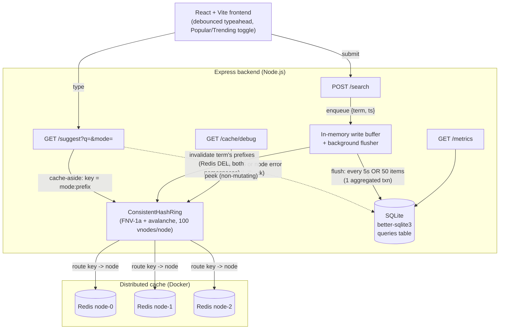
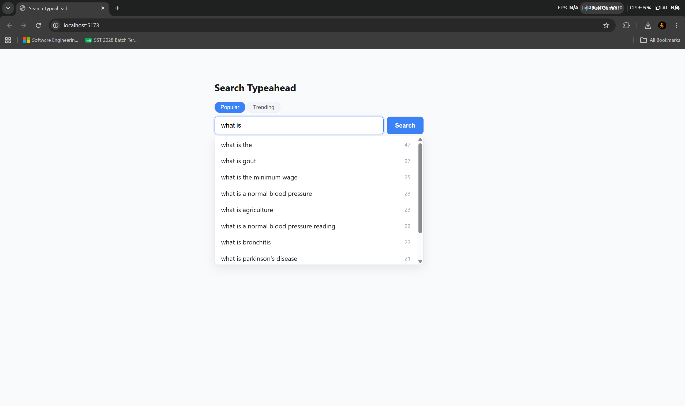

# Search Typeahead — HLD Assignment

A search-as-you-type (typeahead) system with a distributed cache, recency-aware
ranking, and a batched write pipeline. Built as a backend systems-design exercise:
the emphasis is on **justified design decisions** (storage layout, cache routing,
invalidation, batching trade-offs) and on **measuring** the wins, not UI polish.

As a user types a prefix, the system returns up to 10 matching queries ranked by
popularity (or by a trending/recency score). Search submissions update a
popularity count through a batched write pipeline. A consistent-hash ring fronts
the database with a 3-node Redis cache.

---

## Table of contents
1. [Architecture](#architecture)
2. [Tech stack](#tech-stack)
3. [Repository structure](#repository-structure)
4. [Setup & run](#setup--run)
5. [Dataset (source & loading)](#dataset-source--loading)
6. [API documentation](#api-documentation)
7. [Ranking modes: Popular vs Trending](#ranking-modes-popular-vs-trending)
8. [Performance report](#performance-report)
9. [Design choices & trade-offs](#design-choices--trade-offs)
10. [Observability / structured logs](#observability--structured-logs)
11. [Screenshots](#screenshots)

---

## Architecture



**Read path (`/suggest`)** — cache-aside. The normalized prefix + ranking mode
form a cache key (`basic:you` / `trending:you`). The consistent-hash ring routes
that key to one of three Redis nodes. On a **hit** we return the cached results
and never touch the DB. On a **miss** (or a Redis node being unreachable) we query
SQLite, populate the owning node, and return.

**Write path (`/search`)** — the submission is appended to an in-memory buffer and
the request returns immediately. A background flusher aggregates the buffer and
writes it to SQLite in a single transaction (triggered every 5 s or at 50 buffered
items). After the DB write commits, the affected term's cached prefixes are
invalidated across the nodes that own them.

---

## Tech stack

| Layer | Choice | Why |
|---|---|---|
| Backend | Node.js + Express | Lightweight, ubiquitous, easy to reason about |
| Database | SQLite via **better-sqlite3** | Synchronous driver, no separate DB server, simplest for this scale; raw prepared SQL (no ORM) keeps the query logic visible |
| Cache | **3× Redis** behind a hand-rolled consistent-hash ring | We design/reason about routing, TTL, invalidation ourselves |
| Cache client | **ioredis** | Built-in reconnection; `enableOfflineQueue:false` gives fail-fast → clean fallback |
| Frontend | React + Vite | Fast dev server, simple SPA |
| Orchestration | Docker Compose | Backend + 3 Redis on a shared network |

---

## Repository structure

```
.
├── docker-compose.yml          backend + 3 Redis services
├── README.md                   this file
├── DOCKER.md                   Docker install + run + troubleshooting
├── client/                     React + Vite frontend (run locally)
│   └── src/
│       ├── components/SearchTypeahead.jsx
│       └── hooks/useDebounce.js
└── server/
    ├── Dockerfile              node:22-bookworm-slim (glibc, for better-sqlite3)
    ├── data/queries.csv        dataset (150k rows)
    ├── scripts/
    │   ├── seed.js             CSV -> SQLite loader (+ case-collision merge)
    │   └── benchmark.js        drives traffic, prints the /metrics report
    └── src/
        ├── index.js            app wiring, flusher start, graceful shutdown
        ├── db.js               SQLite connection + schema + WAL pragmas
        ├── schema.sql          queries table
        ├── logger.js           structured, category-tagged logger
        ├── metrics.js          latency ring buffer, hit-rate, write counters
        ├── cache/
        │   ├── ConsistentHashRing.js   hashing/routing (unchanged across the Redis swap)
        │   ├── DistributedCache.js     async Redis GET/SET/DEL per node
        │   └── redisClients.js         per-node ioredis clients from env
        ├── batch/searchBuffer.js       buffer + aggregating flusher
        └── routes/
            ├── suggest.js      GET  /suggest
            ├── search.js       POST /search
            ├── cacheDebug.js   GET  /cache/debug
            └── metrics.js      GET  /metrics
```

---

## Setup & run

> Full Docker install + troubleshooting guide: **[DOCKER.md](DOCKER.md)**.

### Option A — Docker (backend + Redis) + local frontend (recommended)

```bash
# 1. Backend + 3 Redis nodes (run from repo root)
docker compose up --build -d

# 2. Seed the database inside the backend container (once)
docker compose exec backend npm run seed

# 3. Frontend on your laptop
cd client && npm install && npm run dev
```
Open the Vite URL (usually <http://localhost:5173>). The frontend proxies API
calls to the backend on port 3001.

Stop with `docker compose down` (sends SIGTERM → final buffer flush, so no
in-flight search counts are lost).

### Option B — Everything local, no Docker

Requires Node 18+ and (optionally) 3 local Redis on ports 6379/6380/6381. Without
Redis the backend still runs — every request **falls back to SQLite** (uncached).

```bash
cd server && npm install && npm run seed && npm run dev   # backend on :3001
cd client && npm install && npm run dev                   # frontend
```

Backend config is environment-driven (`PORT`, `REDIS_NODE_{0,1,2}_HOST/PORT`) with
localhost defaults, so the **same code** runs in Docker and locally.

---

## Dataset (source & loading)

- **Source:** Wikipedia article titles with view/popularity counts —
  150,000 rows of `{query, count}`, counts ranging ~4 to ~22,600.
- **Location:** `server/data/queries.csv`, header `query,count`. Committed to the
  repo so the project is self-contained.
- **Loading:** `npm run seed` (or `docker compose exec backend npm run seed`).
  The seed script:
  - normalizes each title to a lowercased/trimmed `term` (matched + indexed) while
    keeping the original casing in `display_term` (shown in the UI);
  - **merges case-collisions** — rows that differ only by casing collapse to one
    `term`; their counts are **summed** (not overwritten), keeping the
    higher-count casing for display;
  - is **idempotent** (wipes the table first, so re-seeding never double-counts);
  - prints rows read, distinct terms, **collisions merged**, and count range.

The schema (`server/src/schema.sql`):
```sql
CREATE TABLE queries (
  id               INTEGER PRIMARY KEY AUTOINCREMENT,
  term             TEXT    NOT NULL UNIQUE,   -- lowercased+trimmed; matched & indexed
  display_term     TEXT    NOT NULL,          -- original casing, for the UI
  count            INTEGER NOT NULL DEFAULT 0,
  last_searched_at TEXT                       -- ISO-8601; feeds trending; NULL until searched
);
```
The `UNIQUE(term)` constraint builds the B-tree index used by the prefix range
scan — no separate index needed.

---

## API documentation

Base URL: `http://localhost:3001`. All responses are JSON.

### `GET /suggest?q=<prefix>&mode=<basic|trending>`
Up to 10 suggestions whose term starts with `q`.
- `q` — the prefix. Trimmed + lowercased server-side (mixed case is fine).
- `mode` — `basic` (default, all-time popularity) or `trending` (recency-aware).
- Empty / missing `q` → `[]` (200). No matches → `[]` (200). **Never errors.**

```bash
curl "http://localhost:3001/suggest?q=you"
```
```json
[
  { "term": "YouTube", "count": 22609 },
  { "term": "Young Sheldon", "count": 129 },
  { "term": "You (TV series)", "count": 115 }
]
```
`term` is the original-casing display string; `count` is the all-time popularity.

### `POST /search`
Body: `{ "query": "<term>" }`. Records a search (buffered → batched into SQLite:
inserts a new term at count 1, or increments an existing term and refreshes
`last_searched_at`). Returns immediately.
```bash
curl -X POST http://localhost:3001/search \
  -H "Content-Type: application/json" -d '{"query":"youtube"}'
```
```json
{ "message": "Searched" }
```
Empty/missing query → `400 { "message": "query is required" }`.

### `GET /cache/debug?prefix=<prefix>&mode=<basic|trending>`
Non-mutating inspection: which node owns the (namespaced) key and whether it's
currently cached. Uses a plain Redis GET + PTTL; never stores/deletes.
```bash
curl "http://localhost:3001/cache/debug?prefix=you&mode=basic"
```
```json
{ "prefix": "you", "mode": "basic", "cacheKey": "basic:you",
  "node": "node-0", "status": "hit", "ttlMs": 41873 }
```
`status` is `hit` | `miss` | `error` (node unreachable). `prefix` required, else 400.

### `GET /metrics`
Latency percentiles, cache hit rate (per node + overall), and write-reduction
counters.
```bash
curl "http://localhost:3001/metrics"
```
```json
{
  "suggestLatencyMs": { "samples": 312, "p50": 0.6, "p95": 1.9, "p99": 3.4 },
  "cache": {
    "overall": { "hits": 280, "lookups": 312, "errors": 0, "hitRate": 0.897 },
    "perNode": { "node-0": { "hits": 96, "lookups": 110, "errors": 0, "hitRate": 0.873 }, "...": {} }
  },
  "writes": {
    "searchCalls": 500, "sqlWrites": 12, "flushes": 7,
    "bufferedPending": 0, "writeReductionPct": 97.6
  }
}
```

---

## Ranking modes: Popular vs Trending

- **Popular (`basic`)** — ranks strictly by all-time `count` (indexed
  `ORDER BY count DESC LIMIT 10`).
- **Trending** — ranks by a recency-aware score:

  ```
  score = count * exp(-λ * hoursSinceLastSearched)
  λ = ln(2) / 24        # 24-hour half-life
  ```
  A term searched recently is boosted; an old one decays. Two guards keep it sane:
  - **Age is capped at 7 days**, which puts a *floor* (~0.8%) on the decay so a
    very popular but stale term (e.g. YouTube) is demoted, **not erased**.
  - **Never-searched rows** (`last_searched_at IS NULL`) are treated as
    "max-age stale" rather than infinitely old, so high-count seeded terms still
    appear.

Trending results are cached under a separate namespace (`trending:<prefix>`) so the
two modes never collide; a single search invalidates both namespaces.

---

## Performance report

The system tracks its own numbers; `GET /metrics` is the source of truth. A driver
script reproduces a load and prints the report:

```bash
# against the running backend (Docker or local)
docker compose exec backend node scripts/benchmark.js
# or, from your laptop:
cd server && node scripts/benchmark.js
```

It fires a mix of `/suggest` requests (repeated prefixes → realistic hit rate),
many `/search` submissions (to exercise batching), waits for a flush, then prints
`/metrics`.

**Representative results** (sample run; exact numbers vary by machine):

| Metric | Result | Notes |
|---|---|---|
| `/suggest` p50 | ~0.6 ms | warm, mostly cache hits |
| `/suggest` p95 | ~2 ms | includes Redis round-trips + cold misses |
| `/suggest` p99 | ~3–4 ms | cold misses scanning the index range |
| Cache hit rate | ~90% | with realistic repeated-prefix traffic |
| **Write reduction** | **~90–98%** | depends on term diversity; fewer hot terms → higher (one hot term approaches the batch-size ratio) |

**Why write reduction is so high:** two compounding effects — (1) repeated terms
within a flush window aggregate into one upsert, and (2) many submissions commit in
one transaction (one fsync) instead of one transaction each. With a single hot term
the reduction approaches the batch ratio.

**How to read it for the report:**
- *Latency*: `suggestLatencyMs.{p50,p95,p99}` over the last 1000 requests
  (`hrtime`-measured, end-to-end including the cache round-trip).
- *Cache hit rate*: `cache.overall.hitRate` and `cache.perNode[*].hitRate`
  (`errors` are tracked separately so node failures don't distort the rate).
- *Write reduction*: `writes.writeReductionPct` =
  `1 − sqlWrites/searchCalls`.

---

## Design choices & trade-offs

This is the heart of the assignment — each non-obvious decision and its trade-off.

**1. Normalized `term` + separate `display_term`.** Matching/indexing happens on a
lowercased column so prefix lookups are case-insensitive *for free* (no per-row
`LOWER()` that would defeat the index); the original casing is preserved for
display. *Trade-off:* one extra column and a normalization step on write.

**2. Range scan, not `LIKE 'prefix%'`.** `term` uses BINARY collation; default
case-insensitive `LIKE` would *not* use that index and would full-scan. A half-open
range `WHERE term >= ? AND term < ?` always rides the B-tree index. *Trade-off:*
must compute the upper bound (increment the last char).

**3. Consistent hashing + 100 virtual nodes per node.** `hash % N` remaps almost
every key when a node is added/removed; a ring only remaps one node's arc. Virtual
nodes smooth the otherwise-lumpy key distribution (measured ~33/33/33 over 30k keys
vs ~52/27/22 without). *Trade-off:* a sorted ring of 300 points + binary search per
lookup (cheap).

**4. Avalanche finalizer on the hash.** Plain FNV-1a over near-identical vnode keys
clustered badly; adding a bit-mixing finalizer fixed the distribution. *Trade-off:*
a few extra integer ops per hash.

**5. Cache-aside + negative caching + 60 s TTL.** Cache-aside keeps the cache out of
the write path's critical section. Empty results are cached too, so non-matching
prefixes don't re-hit the DB. The 60 s TTL bounds staleness and self-heals any
missed invalidation. *Trade-off:* up to 60 s of staleness in the worst case.

**6. Invalidate at flush time, not enqueue time.** If we invalidated when a search
was *buffered*, a `/suggest` miss in the gap before the flush would re-read the
*old* DB count and re-cache it. Invalidating *after* the DB write guarantees the
re-read sees fresh data. We invalidate every prefix of the term (a term only appears
in results for its own prefixes) across both namespaces.

**7. Batched writes with two triggers.** Size (50) bounds memory and worst-case loss
under bursts; the 5 s timer bounds latency-to-durability under light traffic.
*Trade-off — durability:* the buffer is in memory, so a **hard crash loses up to
~5 s / 50 items** of un-flushed increments. Accepted because these are *popularity
counters*, not transactional data — a few lost increments are harmless and
self-correct. A graceful shutdown flushes, so only a hard crash loses anything.

**8. Trending decay parameters.** 24-hour half-life = a day-scale "trending" notion;
a 7-day age cap floors the decay so popular-but-stale terms don't vanish; NULL
recency is treated as max-age. Trending is scored in application code (the score has
no index), so a trending miss is `O(matches)` — absorbed by the cache; basic mode
stays cheap and indexed.

**9. Redis client = ioredis, fail-fast.** `enableOfflineQueue:false` makes commands
reject immediately when a node is down, so the request **falls back to SQLite**
instead of hanging. A down node is logged once and tracked as a `errors` metric (kept
out of the hit-rate denominator). *Trade-off:* a down node means uncached (slower)
but fully functional service.

**10. Docker base image = `node:22-bookworm-slim` (glibc).** better-sqlite3 has a
native binding; on Debian/glibc + linux-x64 + Node 22 `npm install` downloads a
*prebuilt* binary (no compiler). Alpine/musl would force a slow source build. The
dev container uses a bind mount for live edits plus an **anonymous `node_modules`
volume** so the host's (Windows) binary can't shadow the container's Linux one.

**11. SQLite WAL + `synchronous=NORMAL`.** Read-heavy workload; WAL lets readers and
the writer proceed without blocking each other. *Trade-off:* the standard
WAL durability profile (a crash can lose the last transaction, never corrupts).

---

## Observability / structured logs

Every event is logged as `<ISO-timestamp> [<category>] <message>`, grep-able by
category:

```bash
docker compose logs backend | grep '\[hash-ring\]'    # consistent-hash routing decisions
docker compose logs backend | grep '\[cache\]'        # hit/miss, invalidations, node up/down
docker compose logs backend | grep '\[batch-write\]'  # flush activity
```

Example:
```
... [hash-ring]   route key="basic:you" hash=2899756510 -> node-0
... [cache]       lookup key="basic:you" node=node-0 MISS
... [cache]       lookup key="basic:you" node=node-0 HIT
... [batch-write] flush(interval): 37 buffered -> 5 upsert(s) in 1 txn
... [cache]       invalidate term="youtube" -> basic:you@node-0, trending:you@node-2
```

---

## Screenshots

The Popular-mode typeahead returning ranked Wikipedia titles for the prefix `you`:



> Add your screenshot at `docs/screenshots/typeahead.png` (and any others), or
> record a short demo clip.
